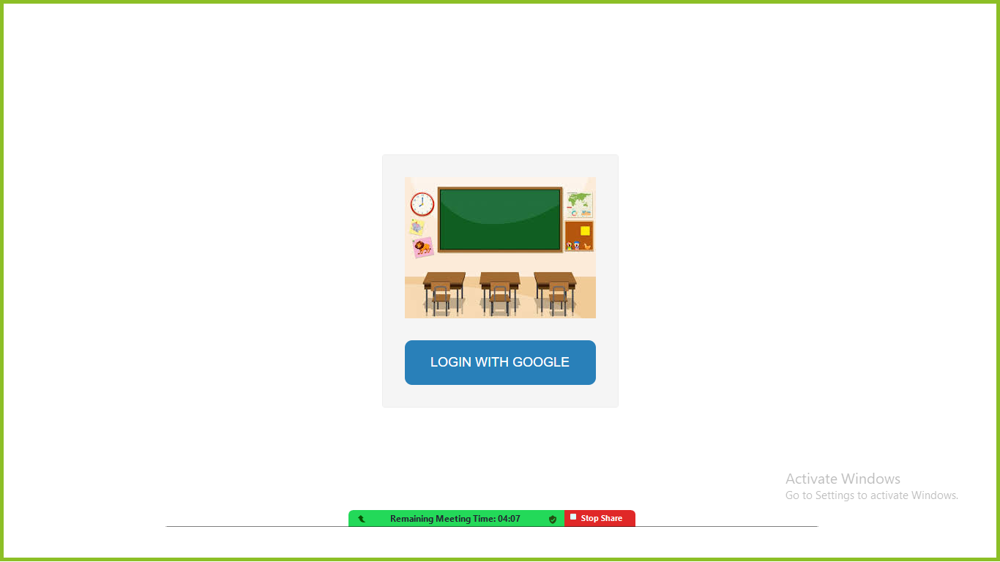
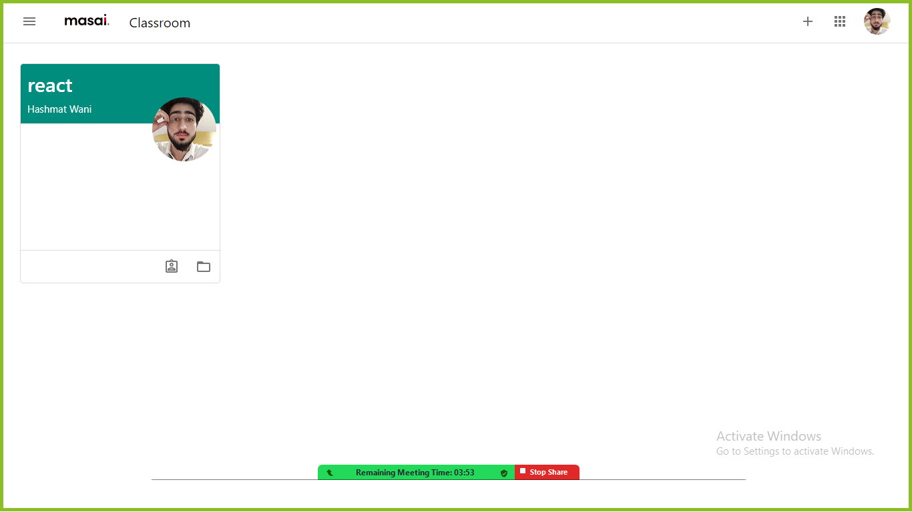
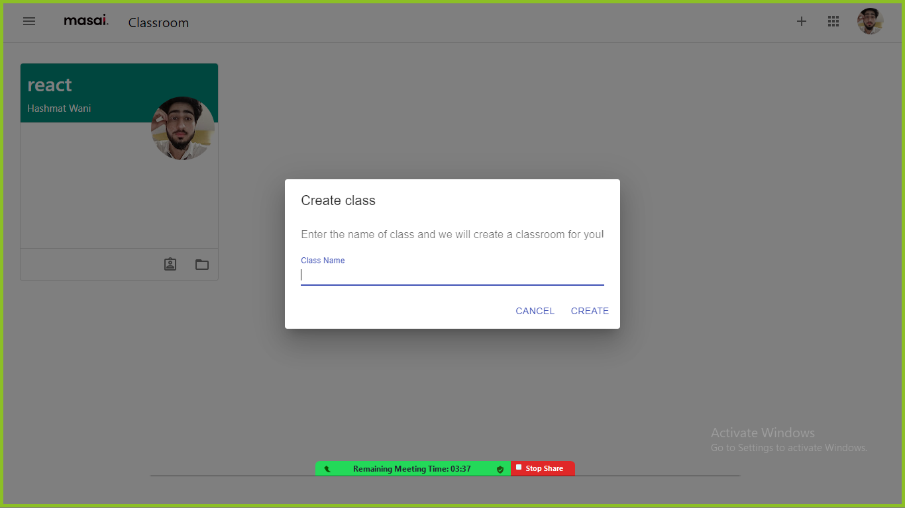
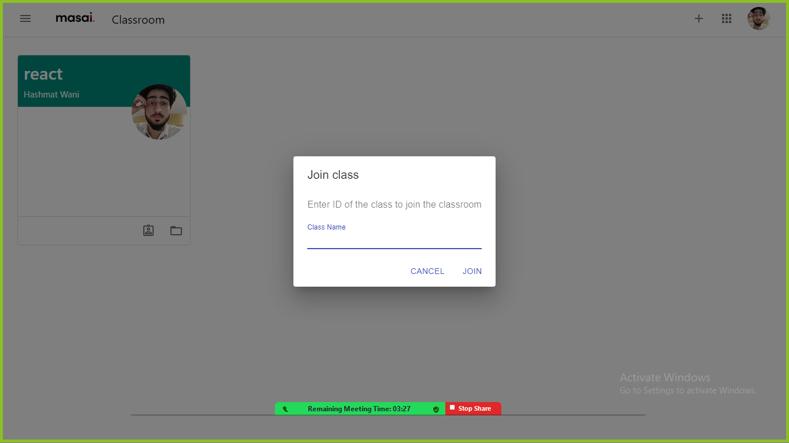

Masai Classroom app built using React, Firebase and Next.js. The app provides a platform for teachers and students to connect, communicate and collaborate in a virtual classroom.

# Features
- Authentication with Firebase
- Create and manage classes
- Create and post announcements and assignments
- View and submit assignments
# Technologies Used
- React
- Firebase
- Next.js

# Requirements
- Node.js
- npm or yarn
- Installation
- Clone the repository

# Desktop View

## Home Page

## Classroom

## Create Room

## Join Room

